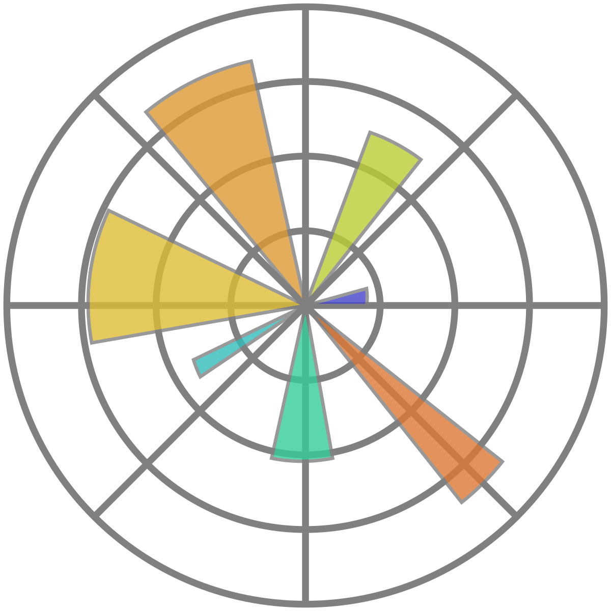

# 🧼 Effect of Hand Washing

## 📄 Project Overview

This project examines the effect of hand washing among childbearing women after they have given birth. The analysis utilizes data to assess how hand washing impacts the health outcomes of these women. The project employs several Python libraries for data manipulation, analysis, and visualization.

## 🧑‍🔬 Methods

### 🔍 Data Analysis

- We use pandas and numpy for data loading, cleaning, and analysis. Key steps include:

  - Loading data into pandas DataFrames
  - Cleaning and preprocessing data
  - Calculating statistical measures

## 📊 Visualization

We employ **matplotlib**, **seaborn**, and **plotly** for data visualization. These libraries help create various plots to illustrate the findings:

- **matplotlib**: Basic plotting and customization
- **seaborn**: Advanced statistical visualizations
- **plotly**: Interactive and dynamic plots

## ⚙️ Installation

To run this project, you need to have Python installed on your system. Additionally, install the necessary libraries using pip:

```sh
pip install pandas numpy matplotlib seaborn plotly
```

<div align="center">
<span>
  
  
  
  
  
  
  
</span>
</div>

##

## 🛠️ Usage

To use the scripts provided in this project, follow these steps:

```
git clone https://github.com/ahmedyar7/Data-Science-n-Visualization-Projects.git

```

> [!NOTE]  
> Try to use jupyter notebook and click on run all

```
main.ipynb
```
